## Interdisciplinary introduction to Data Resources and Services
#### EUI September Programme 2024

&nbsp;

Simone Sacchi, PhD

Research Data Librarian

EUI September Programme 2024, 11/09/2024

---

## Before we start

----

### Welcome to the EUI!

I am Simone Sacchi, Research Data Librarian

[simone.sacchi@eui.eu](mailto:simone.sacchi@eui.eu) - [resdata@eui.eu](mailto:resdata@eui.eu)

You can find me in Library middle floor, room BF086

----

### Cautionary note

* This session is by design a high level introduction and many details are intentionally skipped.
* Resources to go deep in each topic are available on the [Research Data Services](https://www.eui.eu/Research/Library/ResearchDataServices) pages
* Dedicated training session are available in the [Library #researchskills training programme](https://www.eui.eu/Research/Library/Events/ResearchSkills)

---

## Agenda for today
- Introduction
- Data discovery and generation 
- Data management and curation
- Data protection and processing of sensitive data
- 

---

## Introduction

----

### What are we talking about?

> Research data is all information intentionally collected, observed, or generated to validate research findings and substanciate scientific claims

...data, sources, information, etc...
----

### Research Data Service: where exactly?

<a href="https://www.eui.eu/en/services/library" target="_blank">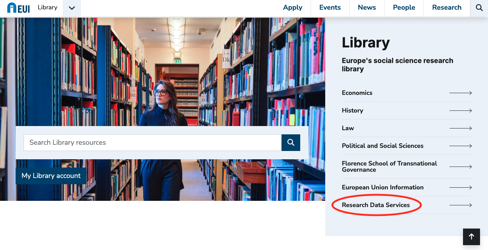</a>

> [https://www.eui.eu/en/services/library](https://www.eui.eu/en/services/library)

----

### Research Data Services: home

<a href="https://www.eui.eu/Research/Library/ResearchDataServices" target="_blank">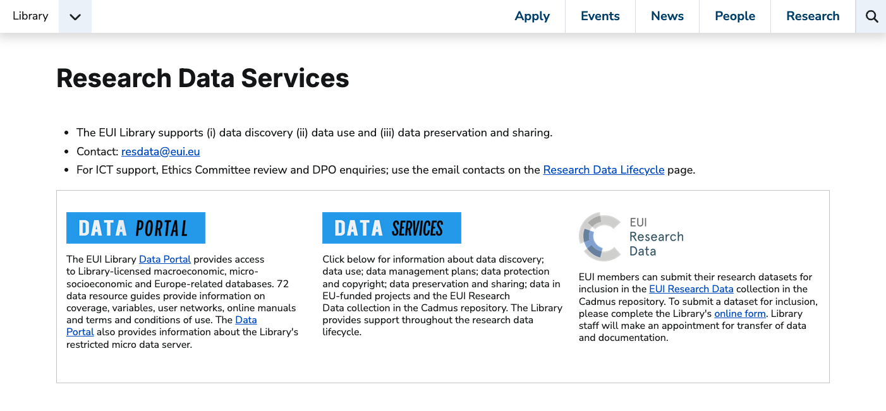</a>

> [https://www.eui.eu/Research/Library/ResearchDataServices](https://www.eui.eu/Research/Library/ResearchDataServices)

----

### Research Data Services: lifecycle model

<a href="https://www.eui.eu/Research/Library/ResearchDataServices" target="_blank">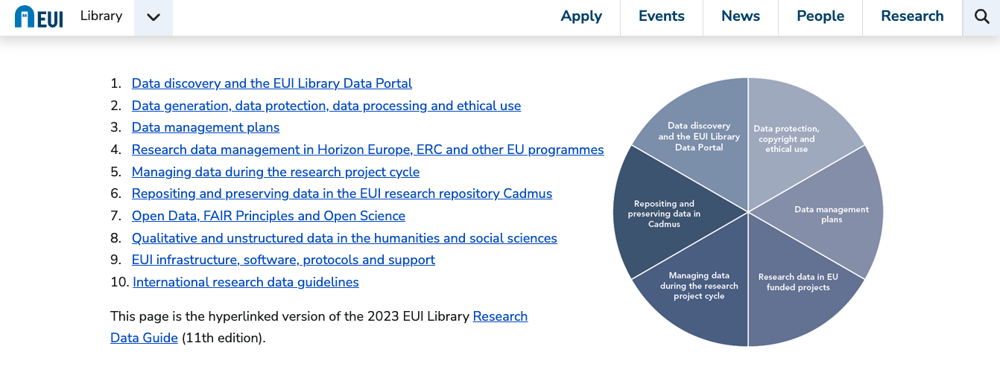</a>

> [https://www.eui.eu/Research/Library/ResearchDataServices](https://www.eui.eu/Research/Library/ResearchDataServices)

---

## Data discovery and access

----

### How to get the data you need

_Survey, interviews, experiments, archival research, text mining, etc._

But also:
- Access to licenced resources
- Reuse of Open Data (research, governmental)
- Agreement with specific data providers

----

### EUI Library Data Portal
<a href="https://www.eui.eu/Research/Library/ResearchGuides/Economics/Statistics/DataPortal" target="_blank">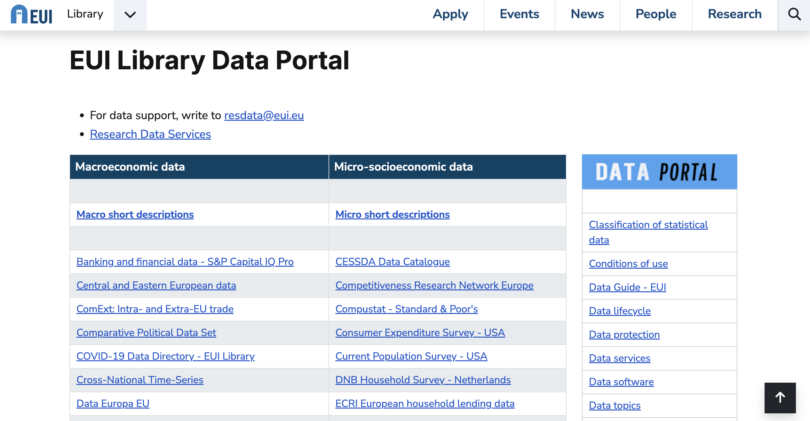</a>

----

### Macro data

<a href="https://www.eui.eu/Research/Library/ResearchGuides/Economics/Statistics/MacroDataSet" target="_blank">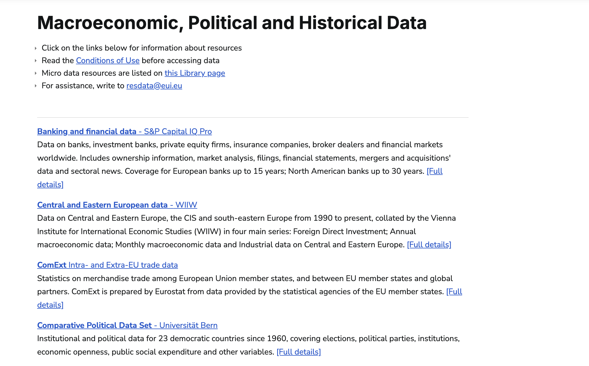</a>

----

### Micro data

<a href="https://www.eui.eu/Research/Library/ResearchGuides/Economics/Statistics/MicroDataSet" target="_blank">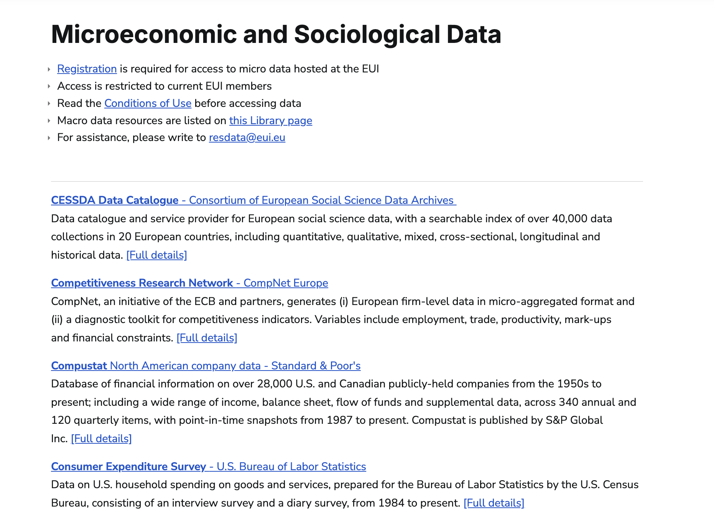</a>

----

### Micro data hosted at the EUI

The EUI hosts on its premises a series of datasets for which specific access conditions apply:
- Special aggrement to be signed with the data provider
- Registration required, form available <a href="https://www.eui.eu/Research/Library/RequestForms/Register-micro-data" target="_blank">here</a>
- Access only through the Library Restricted Server ( K:/ )

> Detailed information is provided on each individual database description page. See <a href="https://www.eui.eu/Research/Library/ResearchGuides/Economics/Statistics/DataPortal/EU-LFS" target="_blank">example</a>

----

### Lubrary Restricted Server ( K:/)

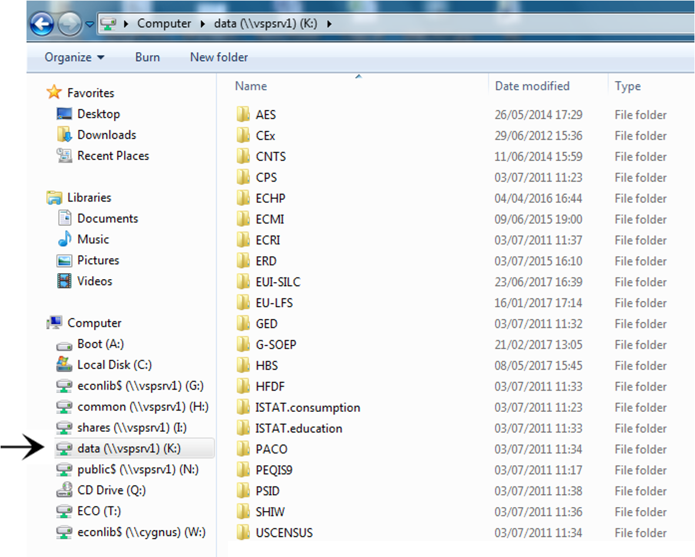

----

### The Library Secure Data Room

- To be used to access highly restricted (sensitive) data  

<a href="https://www.eui.eu/Research/Library/ResearchDataServices/SensitiveData" target="_blank">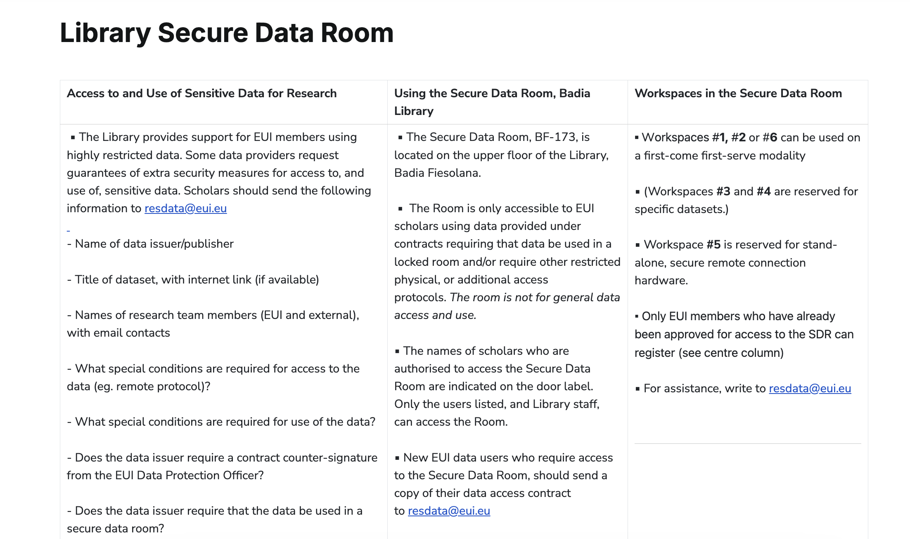</a>

----

### Third party data

- If you require access to restricted data at another institution (data centre, statistics agency, university, archive) you should apply for access early in you research projects because application periods can be lengthy. 

- The Library can help with the formal steps of the process, in particular when the agreement requires the signature of an official EUI legal signatory.

- In some instances, it may be possible for EUI members to obtain access via library consortia. 

::: {.callout-caution}
Some sociological, qualitative and micro geo-coded data can only be accessed at issuers' secure on-site facilities.
::: 

----

### Open governmental and research data

Scholars, government agencies and international organisations increasingly share data, codebooks and software online through repositories or dedicated websites. 

Open research data can be located with dedicated tools and registries:

- [**Google Dataset Search**](https://datasetsearch.research.google.com/) | Developed by Google Research, read more on this [blog post](https://research.google/blog/datasets-at-your-fingertips-in-google-search/)
- [**re3data**](https://www.re3data.org/) | the Registry of Research Data Repositories which is indexed by discipline, sub-discipline, data type and host institution.

----

...let's move now onto the management and curation of data during a research project!

---

## The management and curation of research data

----

### Challenges we face
- How to avoid losing your work?
- How to avoid losing the history of your work?
- How to make sure your future self understands your current work (and the process that went into it)?
- How to make sure that others can understand your work and can validate it?
- How to plan everything so we do not forget?

----

### Opportunities to explore

> Research data are becoming first-class citizens in the scholarly communication landscape!

- Part of a scolarly CV and portolio
- Required by publishers
- Foster visibility, collaboration opportunities, 
- Can contribute to informed decision making in politics, society, economy

----

### What is Research Data Management

> **Research Data Management (RDM)** is an umbrella term covering how you organise, structure, store, and care for the digital information generated or used during a research project.

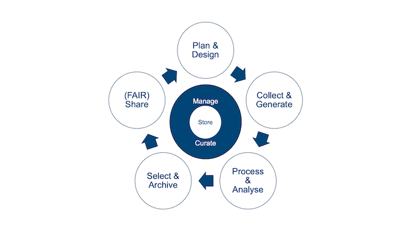

> Management and curation happen throughout the Research Data Lifecycle!

----

### Guiding principles of RDM

You'll hear a lot about the **FAIR Principles** if you are / will be engaged in EU-funded projects!

> Best practices and tool to make your data FAIR: [FAIRsFAIR Project](https://www.fairsfair.eu/tools-software)

----

### RDM practices

To care for your data (but also code, and any other research output) you should adopt the following RDM practices:

- Planning in advance how your data will be managed
- Documenting working practices
- Considering how information will be handled (stored, versioned, documented, etc.) on a day-to-day basis
- Making decisions on what happens to data in the long term – after the project concludes
- Preparing for data to be preserved, and possibly shared for reuse

---

## Plan on how to manage your data

----

### Data Management Plan (DMP)

A __Data Management Plan (DMPs)__ is a document that describes:
* How data is generated, used, elaborated and organised
* How data, and data subjects, are protected
* How data, code and ancillary elements are described and documented
* How data is stored and secured, and how long it will be retained
* How dataset authorship and credit are assigned
* How data is preserved and under what terms, can be shared

 See [EUI Data Management Plans guidelines](https://www.eui.eu/research/library/researchdataservices#DATAMANAGEMENT) for details.

 > Tip: Early- and Mid-career researchers are strongly invited to learn how to prepare a DMP, as they will be required when applying for future project funding.

----

### DMP Tools

**DMP Online** guides you through the process of writing a DMP according to specific funding agences templates (e.g. ERC, Horizon Europe, etc.)

> Not necessary, but useful, and with an account you can also save your own templates.

----

### Ethical Review 

If you are collecting, using and analysing data that include personal and sensitive information you are strongly encouraged to undergo the the **Ethical Revirew** process.
* Personal and sensitive information about human subjects are bound to the __General Data Protection Regulation (GDPR)__
* __Informed consent__ is the key to all you can do with them
* Personal and sensitive data cannot be shared openly if not __Anonymized__ of __Pseudonymised__ 

> EUI information, resources and procedures here:
> * [The Research Data Lifecycle](https://www.eui.eu/Research/Library/ResearchDataServices/StepByStep)
> * [Ethics and Integrity in Academic Research](https://www.eui.eu/ServicesAndAdmin/DeanOfStudies/Ethics-and-Integrity-in-Academic-Research)

----

### Brief on transparency and reproducibility at the planning stage

> If appropriate for your discipline and research methodology consider **pre-registering your study**

- Consider posting your research hypotheses and the planned research design (i.e., methodology) in a publicly available registry (e.g. [AsPredicted](https://aspredicted.org/), [OSF](https://www.cos.io/initiatives/prereg)) ahead of the beginning of the project

- Sharing research design + plans beforehand complements disclosures and openness of research outputs
- It takes time? Yes… It takes more time? No…

---

## Store and organize your data (approriately)

----

## Do not keep your research __only__ on your laptop

----

### Store your Data

The [EUI ICT Service](https://www.eui.eu/en/services/ict-service) provides state-of-the-art solutions to ensure that research data are safely stored and backed up during your project lifecycle. 

- Network drive __G:\\__ (all EUI members, fully backed-up, daily, weekly, monthly, GDPR compliant)
- Microsoft __OneDrive for Business__ (all EUI members, cloud storage, up to 1TB, GDPR compliant)
- Microsoft **SharePoint** (for large scale collaborative projects, no storage limit)

> ☞ [Safeguarding your data](https://www.eui.eu/ServicesAndAdmin/ComputingService/Storage/SafeguardingYourData) (ICT Website)

----

### File/Folder organization

- Folder structure shall reflect the structure of your project
- Files shall be named according to pre-defined conventions:
  - __Vocabulary__: choose a standard vocabulary for file names so that everyone uses and common language.
  - __Punctuation__: decide on conventions for symbols, capitals, hyphens and spaces.
  - __Dates__:  agree on a logical use e.g., YYYYMMDD.
  - __Order__: confirm which element should go first, etc.
  - __Numbers__: specify the number of digits that will be used in numbering.

> Briney, K. A. (2020, June 2). File Naming Convention Worksheet. California Institute of Technology. [https://doi.org/10.7907/894q-zr22](https://doi.org/10.7907/894q-zr22)

----

### However...

PhD Comics [FINAL.doc](https://phdcomics.com/comics/archive.php?comicid=1531)

----
### The solution: Version Control Systems (e.g. Git)

* You can record who made which changes, and when
* You can revert to previous versions
* You can identify and correct conflicts (e.g. possible overwriting)
* Nothing that is *committed* is *ever* lost (unless you try hard...)

**Version control is like an unlimited ‘undo/redo’.**

----

### Where to start with `git` and `GitHub`?

* ["Introduction to Git and Github for Social Science Research"](https://github.com/EUI-Library/researchskills-2023-03-08-git) (slides from a past EUI Library #researchskills session)
* ["Version control with git"](https://swcarpentry.github.io/git-novice/) (Intro to git by [The Carpentries](https://carpentries.org/))
* ["GitHub and Git for research and teaching"](https://www.uu.nl/en/research/research-data-management/tools/software-and-computing/github-and-git) (Utrecht University)
* [Social Science Data Lab](https://github.com/socialsciencedatalab) (Mannheim Centre for European Social Research)

> Stay tuned with the Library [#researchskills page](https://www.eui.eu/Research/Library/Events/ResearchSkills) for upcoming Git/GitHub traini sessions!

----

### Documentation and codebook

Clear and accurate documentation is key to proper data curation:
- purpose and context of the research project, and about the research data outputs
- sources of the data 
- Elaboration of pre-existing data
Data generation (surveys, interviews, experiments)
Documentation should include a description of folders, files, variables, versioning, and – where applicable – information about problematic values, missing observations and weightings
Codebooks, questionnaires and data dictionaries should be included.  A concise note on methodology should be included
Good documentation makes datasets findable, accessible, interoperable and re-usable (FAIR data principles).

## Brief on managing image collections

If you are managing image collections as data consider using __Tropy__
* Often described as the Zotero for images (same developers)
* Built with research in mind
* Build, manage and organize your image library
* Describe your sources, annotate your photos

> Download [Tropy](https://tropy.org/) and watch the EUI Library training on YouTube: ["Introduction to Tropy"](https://youtu.be/yuxlkRlFwhI?si=g2MppxeMhU2csgxx)

----

### Personal and sensitive data

* The collection, use, analysis  of data that include personal and sensitive informationabout human subjects are bound to the __General Data Protection Regulation (GDPR)__
* __Informed consent__ is the key to all you can do
* Personal and sensitive data cannot be shared openly if not __Anonymized__ of __Pseudonymised__ 

> EUI information, resources and procedures here:
> * [The Research Data Lifecycle](https://www.eui.eu/Research/Library/ResearchDataServices/StepByStep)
> * [Ethics and Integrity in Academic Research](https://www.eui.eu/ServicesAndAdmin/DeanOfStudies/Ethics-and-Integrity-in-Academic-Research)

---

## Data Processing and Analysis

----

### Anonymisation

> According to GDPR anonymised data is "information which does not relate to. an identified or identifiable natural person or to personal data rendered anonymous in such a manner that the data subject is not or no longer identifiable"

* Remove personal data identifiers (names, numbers etc.)
* Aggregate, or reduce, the precision of variables, eg: year of birth rather than birth date
* Use a general level of geo-coding
* Timing of anonymisation:
  * At time of data collection
  * During elaboration (data processing)
  * Public version of data can be created

> Fully anonimised data (to the best of one's knowledge) do not fall anymore under GDPR constraints

----

### Pseudonymisation

* Provide justification for why data are not anonymised (eg. follow-up wave of survey)
* Replace personal identifiers (such as names) with unique identifiers (codes)
* Store/encrypt pseudonyms separately

> Pseudonymised data can be anonymised by destroying code files and decryption key. Data should be deleted at end of retention period.

----

### Data deletion

- At the end of a research project, it may be necessary to permanently delete sensitive data used in the elaboration phase. 
- Many micro-socioeconomic data providers (eg. Eurostat) require deletion for work-files and non-aggregate outputs. 
- EUI members can use a [disk-wipe tool](https://en.wikipedia.org/wiki/List_of_data-erasing_software) to performs byte-by-byte deletion of data
- If the data provider requires a compliance statement, the name of the software used, the location of the device, the name of the drive and the time of deletion should be recorded.

---

### Data analysis tools (EUI supported)

The **EUI ICT Service** provides licenses and support for the following [research and data analysis software](https://www.eui.eu/ServicesAndAdmin/ComputingService/Software/SoftwareResearch):

**EUI Workstations**
- Datastream Advance
- Datastream for Office Excel Add-in
- MATLAB
- R Studio
- Stata/MP

**Personal laptops**
- ArcGIS
- MATLAB
- MAXQDA (LAW and SPS)
- Stata/SE
- Overleaf (ECO and SPS)

**HPC cluster**
- MatLab R2022a
- Stata 17 MP
- R 4.1.2
- Julia 1.7.3

> Qualtrics is also available to conduct online surveys (contact [HelpDesk](https://www.eui.eu/Helpdesk))
----

### Additional resources: Sage Methods and Sage Campus

<a href="https://www.eui.eu/Research/Library/ResearchGuides/Economics/SAGEmethods" target="_blank">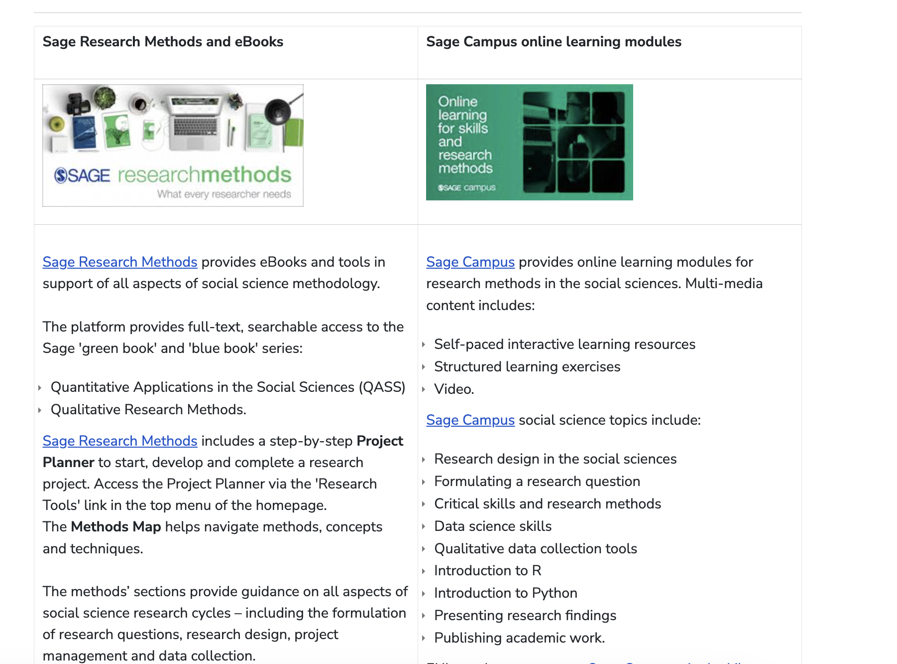</a>

----

### Additional resources: Data textbooks and manuals

The library constantly updates the collection on data-related manuals and textbooks:
- Library middle floor: **001-005**
- Social science data methods: **300.182**
- Statistical & data science: **519.5**

> You can search all the manuals and (paper and eBooks) via the [Library Catalogue](https://biblio.eui.eu/)

---

## Archive (and share) you data in a research repository

----

### Why it matters

Archive your research data in an **repository** has many benifits:
- They are assigned a persistent identifier (same as publications)
- They are curated and preserved in the long term
- They can be cited and you be credited if reused
- Contributes to transparency and reproducibility

> Principle: "as open as possible but as closed as necessary"

----

### Cadmus, the EUI Research Repository

<a href="https://cadmus.eui.eu/" target="_blank">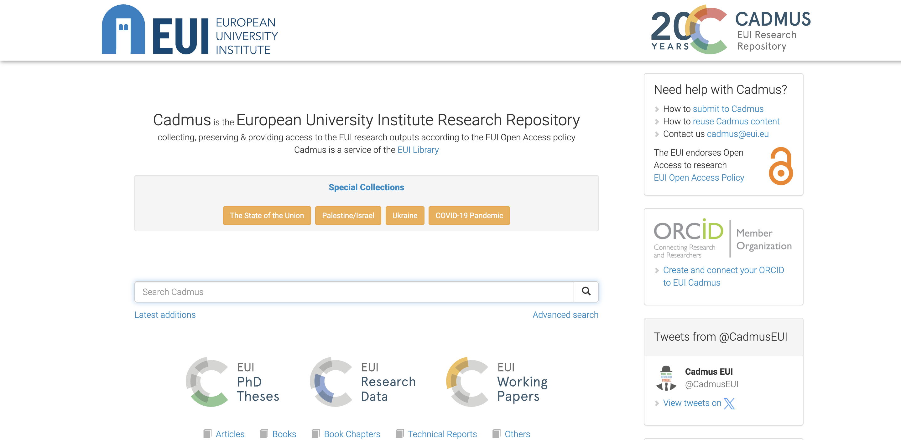</a>

----

### How to register and archive data in Cadmus

<a href="https://www.eui.eu/Research/Library/ResearchDataServices/EUIResDataWorkflow" target="_blank">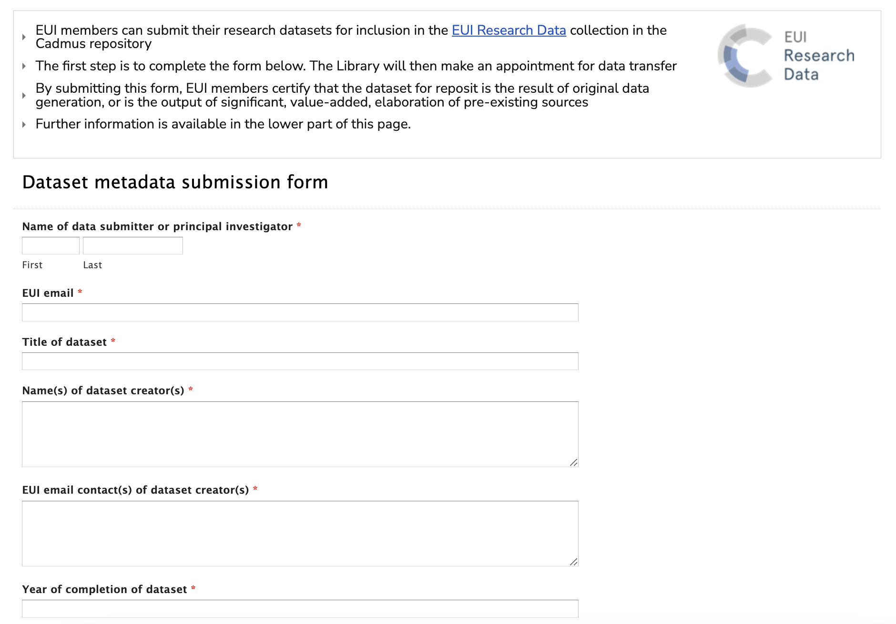</a>

----

### Prepare the data for submission

- Check that there are no data protection and copyright violations
- Organize your data in a structure folder (if necessary)
- Prepare data documentation
- Large datasets should be submitted in a compressed format (eg. .zip, .tgz).
- Archiving is finalised by Library staff, in consultation with the creator.

> Library staff can advise at every stage of the process, reach out to [resdata@eui.eu](mailto:resdata@eui.eu)

----

### Data as original work

- The scholar(s) submitting the dataset for reposit must be the creator(s) of the dataset or a delegate of the P.I.
- The dataset must be the output of original data generation; or must be the output of significant, value-added, elaboration of pre-existing sources
- If the dataset is derived from pre-existing sources, those sources must be clearly indicated.

----

### Datasets in Cadmus

<a href="https://cadmus.eui.eu/handle/1814/64544" target="_blank">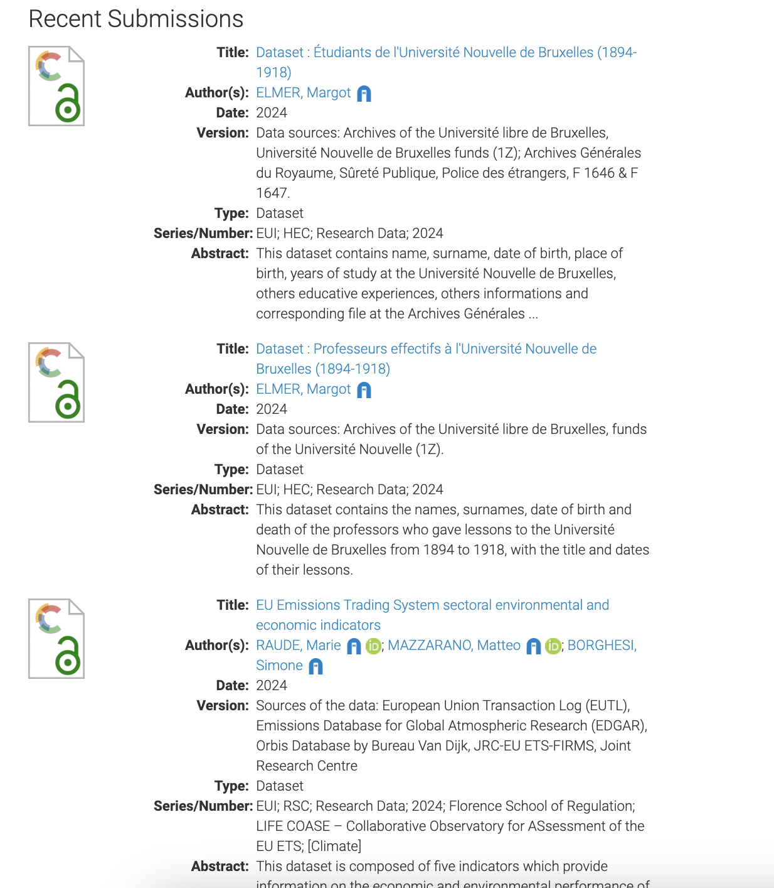</a>

 
 

- Datasets will appear in [Cadmus](https://cadmus.eui.eu/handle/1814/64544) and in the [Library catalogue](https://biblio.eui.eu/)
- Will also be indexed automatically in: 
  - [OpenAIRE](https://explore.openaire.eu/) (pan-Euroepan research registry)
  - [WorldCat](https://search.worldcat.org/) (global index)

---

## Conclusion and wrap-up

----

## Slides are available!
- Linked from the Library **Research Data Services** [page](https://www.eui.eu/Research/Library/ResearchDataServices)
- On the **EUI Library GitHub Organization**:
  * Web version: [https://eui-library.github.io/september-programme-2024-interdisciplinary-data/](https://eui-library.github.io/september-programme-2024-interdisciplinary-data/)
  * GitHub repo: [https://github.com/EUI-Library/september-programme-2024-interdisciplinary-data](https://github.com/EUI-Library/september-programme-2024-interdisciplinary-data)

----

### We are here to help!

> The **EUI Library** is here to help you all be successful in your research endeavours.

Please, reach out, in person, via Teams on by email!

**Simone Sacchi**, Research Data Librarian

[simone.sacchi@eui.eu](mailto:simone.sacchi@eui.eu) - [resdata@eui.eu](mailto:resdata@eui.eu)

Again, you can find me in Library middle floor, **room BF086**

----

## Questions?