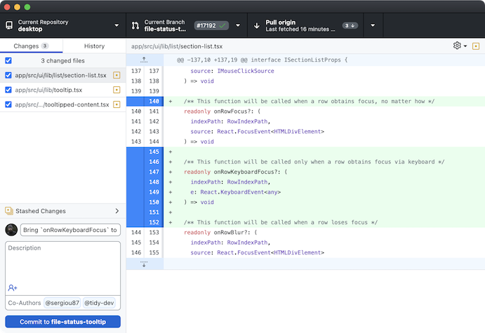

## Your data, your code, your papers, your research
#### make the most of your scholarly assets

&nbsp;

Simone Sacchi, PhD

Research Data Librarian

EUI Library #researchskills session 13/03/2024

---

## Before we start

----

### Let's make a round of introductions

* Name
* Department / Unit

----

### Cautionary note

* This training is very much at the introductory level and many details are intentionally skipped.
* Resources to go deep in each topic are at the bottom of each slides.

---

## Agenda for today
- Introduction
- The basics of safeguarding your scholarly assets 
- How to keep track of changes and why it matters
- Research data and their curation
- Transparency, reproducibility and trust
- Conclusion and wrap-up

---

# Introduction

----

### (Digital) scholarly asset: what the heck is that?

- Anything collected/generated/produced during a research endeavour or other academic practices
- Some outputs are transitory in nature (e.g. raw data, drafts etc.)
- Some are intended to be “final” (a published paper)
- All go through changes, revisions, updates, etc.

> N.B. scholarly assets, research outputs, etc. use the term you prefer!

----

### Challenges we face
- How do we avoid losing our work?
- How do we avoid losing the history of our work?
- How do we make sure my future self understands our current work (and the process that went into it)?
- How do we make sure that others can understand our work and can validate it?
- How can we plan everything so we do not forget?

----

### Plan, plan, and then... act!

- Plan your research (thoroughly)
- Plan how to curate data, sources & code (and revise accordingly)
- Plan how to 
- Plan how to maximize impact of your scholarly assets

---

## The basics of safeguarding your scholarly assets

----

----

## Do not keep your research __only__ on your laptop

----
### Tools at the EUI
- Network drive __G:\\__ (all EUI members, fully backed-up, daily, weekly, monthly, GDPR compliant)
- Microsoft __OneDrive for Business__ (all EUI members, cloud storage, up to 1TB, GDPR compliant)

_but also_

- External hard drive and/or other cloud storage (your own)

> ☞ [Safeguarding your data](https://www.eui.eu/ServicesAndAdmin/ComputingService/Storage/SafeguardingYourData) (ICT Website)

----

### OneDrive for Business

* Full integration with Office 365 software suite
* Sync files between the cloud and your Mac or Windows computer(s) via free app
* Free OneDrive for Business mobile app available on several platforms including Android, iOS, macOS and MS Windows
* Easy recovery from accidental deletes or malicious attacks
* Full activity auditing logs

> ☞ Just login with your EUI credentials

----

## ...now let's stop with the basics...

---

## How to keep track of changes and why it matters

----
### Is OneDrive enough for you?

OneDrive may very well be enough for you, but...
- Microsoft versioning is quite rudimental and not transparent
- You can go back up to a certain point, and if you make changes you lose your previous way forward
- There is no way to add "messages" about where you stand
- You still have to rely on file naming conventions for proper versioning

----
### Brief excursus on file naming conventions
- __Vocabulary__: choose a standard vocabulary for file names so that everyone uses and common language.

- __Punctuation__: decide on conventions for symbols, capitals, hyphens and spaces.

- __Dates__:  agree on a logical use e.g., YYYYMMDD.

- __Order__: confirm which element should go first, etc.

- __Numbers__: specify the number of digits that will be used in numbering.

> Briney, K. A. (2020, June 2). File Naming Convention Worksheet. California Institute of Technology. [https://doi.org/10.7907/894q-zr22](https://doi.org/10.7907/894q-zr22)

----

### However, do you recognise yourself?

PhD Comics [FINAL.doc](https://phdcomics.com/comics/archive.php?comicid=1531)

----
### The solution: version control systems

* We can record who made which changes, and when
* We can revert to previous versions
* We can identify and correct conflicts (e.g. possible overwriting)
* Nothing that is *committed* is *ever* lost (unless you try hard…)

**Version control is like an unlimited ‘undo/redo’.**

> This is basis for code development, but can be applied also to research!

---

### Version control with `git` and `GitHub`

----
## Don't be scared...

----

### How version control works

Version control is like a 'recording' of history

...Rewind and play changes back again!

----

### What version control systems do

* Version control systems manage this process
   * track changes
   * store metadata (who, when)
   * record 'versions' (a.k.a. *commits*)
* The complete history of *commits* and metadata is a *repository*

----

### Core `git` concepts: init / add / commit
 
* You initialize a (local) repository within a folder (`git init`)
* You create/modify a file in the folder & save it
* You add the file to *staging area* (`git add`)
* You commit changes (`git commit -m "my change"`)

----

### The staging area

* We don't always want to commit all changes
* The *staging area* holds changes we want to commit
  * (other files may also be changed, but we don't want to commit them)

----

### Not command line fans? There are apps!

[GitHub Desktop](https://desktop.github.com/)

----

### ... and there are integrations!

[R Studio](https://github.com/rstudio/rstudio)

----

## Remote repositories and GitHub

GitHub Saved My Life!

----

### Whats is GitHub?

* Cloud service for `git`
* Replicate, backup your repositories in the cloud
* Sync across multiple computers
* Visualize changes in an intuitive way

> [https://github.com/](https://github.com/)

----
### Where to start with `git` and `GitHub`?

* ["Introduction to Git and Github for Social Science Research"](https://github.com/EUI-Library/researchskills-2023-03-08-git) (slides from a past EUI Library #researchskills session)
* ["Version control with git"](https://swcarpentry.github.io/git-novice/) (Intro to git by [The Carpentries](https://carpentries.org/))
* ["GitHub and Git for research and teaching"](https://www.uu.nl/en/research/research-data-management/tools/software-and-computing/github-and-git) (Utrecht University)
* [Social Science Data Lab](https://github.com/socialsciencedatalab) (Mannheim Centre for European Social Research)

> There are many wonderful online resources!

---

## Research data and their curation

----

### What is Research Data Management?

__Research Data Management (RDM)__ is a general term that covers how you organize, structure, store, and care for the information used or generated during a research project.

> Research data are becoming first-class citizens in the scholarly communication landscape!

----

### Principles of RDM
* General principles, the __FAIR principles__:

> Best practices and tool to make your data FAIR: [FAIRsFAIR Project](https://www.fairsfair.eu/tools-software)

----

### Data Management Plans (DMPs)

__Data Management Plans (DMPs)__ are documents that describe:
* How data is generated used, elaborated and organised
* How data, and data subjects, are protected
* How data, code and ancillary elements are described and documented
* How data is stored and secured, and how long it will be retained
* How dataset authorship and credit are assigned
* How data is preserved and under what terms, can be shared

> [EUI Data Management Plans guidelines](https://www.eui.eu/research/library/researchdataservices#DATAMANAGEMENT)

----

### Personal and sensitive data

* The collection, use, analysis  of data that include personal and sensitive informationabout human subjects are bound to the __General Data Protection Regulation (GDPR)__
* __Informed consent__ is the key to all you can do
* Personal and sensitive data cannot be shared openly if not __Anonymized__ of __Pseudonymised__ 

> EUI information, resources and procedures here:
>  * [The Research Data Lifecycle](https://www.eui.eu/Research/Library/ResearchDataServices/StepByStep)
> * [Ethics and Integrity in Academic Research](https://www.eui.eu/ServicesAndAdmin/DeanOfStudies/Ethics-and-Integrity-in-Academic-Research)

----

### Anonymisation

* Remove personal data identifiers (names, postcodes, workplaces, telephone numbers &c.)
* Aggregate, or reduce, the precision of variables, eg: year of birth rather than birth date
* Use a general level of geo-coding
* Timing of anonymisation:
  * At time of data collection
  * During elaboration (data processing)
  * Public version of data can be created

> Fully anonimised data (to the best of one's knowledge) do not fall anymore under GDPR constraints

----

### Pseudonymisation

* Provide justification for why data are not anonymised (eg. follow-up wave of survey)
* Replace personal identifiers (such as names) with unique identifiers (codes)
* Store/encrypt pseudonyms separately

> Pseudonymised data can be anonymised by destroying code files and decryption key. Data should be deleted at end of retention period.

---

## A note on transparency, reproducibility and trust

----

### What contributes to building trust in your research?

_"be as open as possible, and as closed as necessary"_

* The (open) availability of your papers, your data, and your code and their changes over time (e.g. on __GitHub__)
  * Consider submitting to [Cadmus, the EUI Research Repository](https://cadmus.eui.eu/) (or a disciplinary one)
* Your DMPs
* Your research plan (e.g. a Study Pre-Registration)

> ["Transparency, Reproducibility and Impact: Placing Open Science Into Practice"](https://www.eui.eu/Documents/Research/Library/PublishingAndOpenScience/Intro-to-Open-Science-20231025.pdf), Simone Sacchi, CIVICA Training, 25 October 2023

---

## Conclusion and wrap-up

----

### On (Digital) scholarly assets

* Physical objects persist through time and decay (relatively) slowly if the physical environment is appropriate (temperature, light, etc.)

* Digital objects are much more “fragile”: they rely on physical media for storage, computational resources and applications for their appropriate access and use and suffer “technology obsolescence” 

> Both share the issue that without proper (recorded) contextual information their “intellectual content” may be lost over time (Rosetta Stone, anyone?)

----

### What we learned today

* Care, care, care about your scholary assets
* Think about your future self as your first and foremost collaborator
* Everything you produce has potential future value for you, for the academic community and society
* There are practices and tools that can help along the way

---

## Questions?

Simone Sacchi, Research Data Librarian

Library, European University Institute 

[simone.sacchi@eui.eu](simone.sacchi@eui.eu)